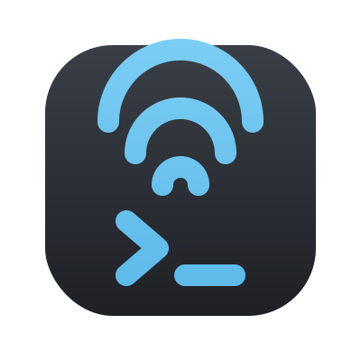
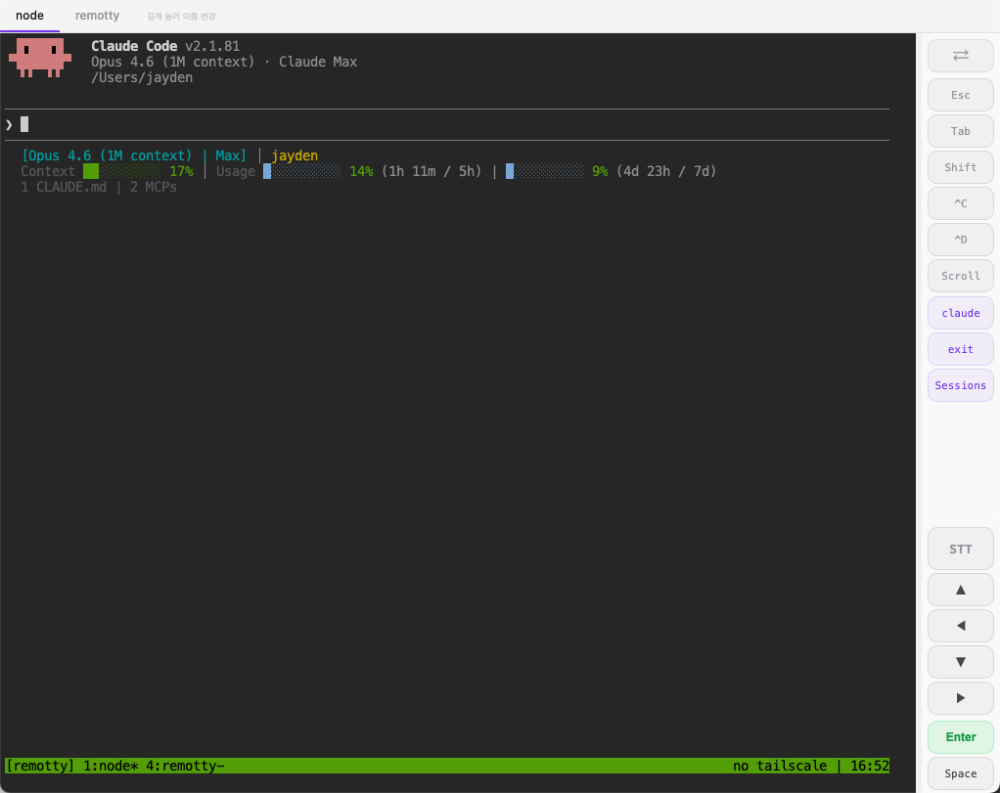
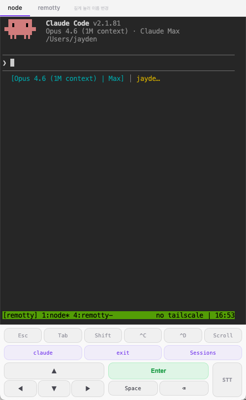
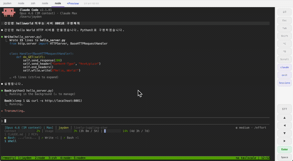
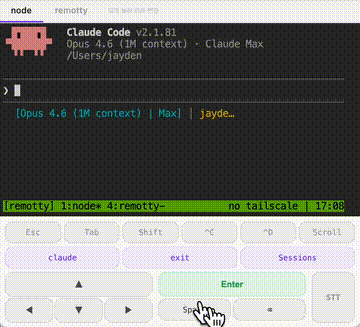

<p align="center">
  
  <h1 align="center">Remotty</h1>
  <p align="center">
    <strong>Your terminal, from anywhere. Even from your phone.</strong>
  </p>
  <p align="center">
    One Python file. Zero dependencies. No build step.
  </p>
</p>

---

> **Remotty** = remote + tty

Running Claude Code overnight? Kicked off a long build? Left Codex working on a refactor?

Check in from your phone. Scroll through the output. **Speak a command.** All from a browser — no SSH app, no extra setup.

**Pack your MacBook in your bag, connect your phone's hotspot, and keep working from the bus.** Tap the STT button, say "git status", and it types it into your terminal. Your Mac can stay closed.

<p align="center">
  
  &nbsp;&nbsp;
  
</p>
<p align="center">
  <em>Left: foldable / landscape with side panel — Right: phone portrait</em>
</p>

## Why remotty?

Claude Code, Codex, and other AI agents run long tasks in your terminal. You shouldn't have to sit in front of your Mac waiting. Remotty lets you walk away and check back from any device.

### "What about Claude Code Remote?"

Yes, Anthropic offers [Claude Code Remote](https://docs.anthropic.com/en/docs/claude-code/remote). But once you actually use it, you'll notice:

- **It's unstable.** Connections drop frequently, and sessions can vanish without warning.
- **It's not what I wanted.** OpenClaude channel updates, version changes, and other factors outside your control can shift the environment at any time — breaking your workflow when you least expect it.
- **It's not your terminal.** Your local environment, your dotfiles, your tmux config — you want all of that as-is. On a remote container, something always feels off.

Remotty opens **your own terminal on your own Mac** in a browser. No cloud service dependency, your environment stays 100% intact, and you can connect from anywhere.

|  | remotty | others |
|---|---|---|
| Install | `make install` | Docker, Node.js, config files... |
| Server | 1 file (`server.py`) | frameworks, packages, builds |
| Dependencies | Python stdlib only | npm, pip, cargo... |
| Web UI | 3 files (HTML+CSS+JS) | React, webpack, 200MB node_modules |
| Mobile input | touch + voice (STT) | keyboard only |
| Remote preview | Tailscale로 어디서든 dev server 미리보기 가능 | 별도 터널링 필요 |
| Auto-start | built-in (launchd) | manual setup |

## How it works

```
Terminal → tmux → ttyd → reverse proxy → Browser
```

1. Your terminal runs inside a tmux session called `remotty`
2. The server watches tmux and lists active windows
3. Click a session in the web dashboard — you're in. Same session, same I/O

Claude Code running in window 2? Tap it. You see exactly what it sees. You can type exactly as if you were there.

## Quick start

```bash
brew install tmux ttyd                      # one-time
git clone https://github.com/Arc1el/remotty.git
cd remotty
make install                                # done
```

## Open in browser

```
https://localhost:7777
```

**`https://`**, not `http://`. `make install` runs the server with HTTPS enabled.
On first visit, your browser will show a security warning — tap "Advanced" → "Proceed" once.

## Access from your phone with Tailscale (recommended)

**We strongly recommend setting up [Tailscale](https://tailscale.com/docs/how-to/quickstart).** It gives your MacBook a fixed IP that works everywhere — same Wi-Fi, phone hotspot, coffee shop, or across the globe. No port forwarding, no VPN config, just install and it works.

```bash
brew install tailscale                  # install
sudo brew services start tailscale     # start the Tailscale daemon
tailscale login                         # authenticate (opens browser)
tailscale ip -4                         # get your stable IP
# → https://100.x.x.x:7777 from any device on your tailnet
```

Install Tailscale on your phone too ([iOS](https://apps.apple.com/app/tailscale/id1470499037) / [Android](https://play.google.com/store/apps/details?id=com.tailscale.ipn)) and log in with the same account. Bookmark `https://100.x.x.x:7777` — it always connects, whether you're on the same network or not.

> **No Tailscale?** If your phone and Mac are on the same network (Wi-Fi or hotspot), connect via your Mac's local IP. Or use the **phone hotspot trick** — connect your MacBook to your phone's hotspot, close the lid, put it in your bag, and open `https://localhost:7777` on your phone.

## Features

### Mobile-first controls

Remotty is built for the phone in your hand, not the keyboard on your desk.

- **Touch controls** — arrow keys, Enter, Ctrl+C, Escape, Tab — all the keys you need, designed for thumbs
- **Speech-to-Text (STT)** — tap the STT button, speak a command, send it to the terminal. No tiny keyboard needed. Supports EN and 한국어 — switch languages in the listening bar
- **Voice Command** — hands-free terminal control. Say "다음" / "ok" to press Enter, "취소" / "cancel" to send Ctrl+C. Orange pulse glow shows the mode is active
- **Scroll mode** — swipe to scroll through terminal history via tmux copy-mode
- **Session switcher** — tab bar at the top. Switch sessions without going back to the dashboard
- **Foldable / wide mobile** — on wider screens (Galaxy Fold, iPad, landscape), controls move to a side panel with a draggable resize handle. Terminal gets maximum screen space while controls stay accessible

### Session management

- **Session sharing** — web and terminal share the same session. Type in one, see it in the other
- **Multiple windows** — run Claude Code in one window, your shell in another
- **Session rename** — long-press a tab (terminal) or tap the edit icon (dashboard) to rename
- **Create from web** — tap `+` to spawn a new terminal window

### Dev server preview

- **Inline preview** — add a local dev server port and preview web pages without leaving Remotty
- **Path navigation** — URL bar to jump to any route. Works with SPA routers, API endpoints, etc.
- **Reverse-proxied** — previews go through Remotty's HTTPS, so no mixed-content or extra port exposure

### Infrastructure

- **HTTPS** — self-signed cert auto-generated on first run. Required for STT and other modern browser APIs
- **Reverse proxy** — ttyd and dev server previews served through a single port. No mixed content
- **Auto-cleanup** — idle terminal backends are reaped automatically
- **Auto-start** — server starts on login, restarts on crash (launchd)
- **Dark / Light theme** — toggle in the dashboard header. Glassmorphism UI with backdrop blur

## Dev server preview

<p align="center">
  
  <br>
  <em>Click a localhost link in the terminal. It opens as a preview tab.</em>
</p>

Building a web app with Claude Code or Codex? Tell it to start a dev server on any port — then preview the result right inside Remotty without switching apps.

Tap **+Preview** in the session bar, enter the port number (e.g. `3000`, `5173`), and the page loads in an embedded browser tab. Since Remotty sessions run over Tailscale, this works from your phone, a coffee shop, or anywhere — no extra tunneling required.

- **Add preview** — tap `+Preview`, enter a port. The dev server page loads inline
- **Path navigation** — edit the URL bar to jump to any route (e.g. `/dashboard`, `/api/health`)
- **Refresh** — reload the preview without leaving the terminal
- **Open externally** — pop the preview into a new browser tab
- **Close** — tap `x` on the preview tab to remove it
- **Persistent** — preview ports are saved in localStorage, so they survive page reloads

The preview is reverse-proxied through Remotty's HTTPS server, so there are no mixed-content issues and no extra ports to expose.

> **Example workflow:** You're on the bus. You tell Claude Code "make a landing page on port 5173." It starts Vite. You tap `+Preview`, type `5173`, and see the result — all from your phone.

## Voice input (STT)
<p align="center">
  
  <br>
  <em>Speak a command. It types into your terminal.</em>
</p>
Tap the STT button in the terminal controls to start listening. A bar appears with:

- Your transcribed text (live preview)
- **Language toggle** — tap `EN` / `한` to switch between English and Korean
- **Send** (✓) — sends the text to the terminal
- **Cancel** (✕) — discard and close

STT uses the browser's built-in [Web Speech API](https://developer.mozilla.org/en-US/docs/Web/API/Web_Speech_API) — no API keys, no external services, no cost. Works in Chrome, Safari, and Edge. Requires HTTPS and microphone permission.

> **Tip:** On desktop, you may need to manually allow microphone access in browser settings for self-signed cert sites.

## Voice Command

<p align="center">
  
  <br>
  <em>Say "다음" to press Enter, "취소" to send Ctrl+C — hands-free.</em>
</p>

Claude Code asks "Do you want to continue?" — just say **"다음"** or **"ok"**. No need to touch anything.

Voice Command mode turns your microphone into a hands-free controller. It continuously listens for short keywords and maps them to terminal keys, so you can approve, reject, or navigate AI agent prompts without looking at the screen.

Tap the **Voice** button in the control panel to toggle the mode. An orange pulse glow wraps the terminal while active, and a toast in the center shows what was recognized.

### Keyword → Action

| Action | Keywords (한국어) | Keywords (English) |
|---|---|---|
| **Enter** ↵ | 다음, 확인, 오케이, 알겠어, 네, 응, 좋아, 진행, 계속 | next, ok, yes, confirm, continue, go, enter |
| **Ctrl+C** ✕ | 취소, 안돼, 중지, 멈춰, 아니, 그만 | cancel, stop, no, abort, quit |
| **Dictate** | 음성인식, 입력, 텍스트, 받아쓰기 | dictate, type, input, text |

- Unrecognized words are ignored — the toast briefly shows `—` so you know it heard something
- The language follows the same EN/한 toggle used by STT
- Microphone auto-restarts if the browser's speech recognition session ends

### Voice Dictation — STT without touching a button

<p align="center">
  
  <br>
  <em>Say "음성인식" to start dictating. It auto-sends when you stop talking.</em>
</p>

With Voice Command mode on, you don't need the STT button anymore. Just say **"음성인식"** or **"dictate"** — the voice bar opens, you speak a full command, and after 1.5 seconds of silence it auto-sends to the terminal. Then it goes right back to keyword listening. Everything stays hands-free.

> **Example:** You're making coffee while Claude Code runs a multi-step refactor. It pauses — you say "다음". It pauses again — "다음". Now you need to type a command. You say "음성인식", then "git status" — it types and sends it. Back to listening. You never touched your phone.

## Terminal setup

### Kaku

Automatic. `make install` handles everything.

### iTerm2

1. Open **iTerm2 → Settings → Profiles**
2. Select your profile (or create a new one)
3. Go to the **General** tab
4. Under **Command**, select **Command** and enter:

```
/opt/homebrew/bin/tmux -u new-session -t remotty \; new-window
```

5. Restart iTerm2

Every new tab/window will create a **new tmux window** inside the `remotty` session — same behavior as Kaku.

### Any other terminal

Add to your `~/.zshrc` (or `~/.bashrc`):

```bash
# remotty: auto-attach tmux session
if [ -z "$TMUX" ]; then
  tmux new-session -A -s remotty
fi
```

## HTTPS

`make install` sets up the server with HTTPS by default (`--https` flag). A self-signed certificate is auto-generated on first run in `.certs/`.

Your browser will show a security warning on first visit — tap "Advanced" → "Proceed" once, and it won't ask again for that device.

**Why the warning is fine:** The certificate is self-signed (not verified by a CA), but the connection is still fully encrypted. Since you own both the server and the client, there's no real security concern — this is standard for local/private servers.

**Why HTTPS matters:** Speech-to-Text, microphone access, and other modern browser APIs require a [secure context](https://developer.mozilla.org/en-US/docs/Web/Security/Secure_Contexts). HTTPS provides that, even with a self-signed cert.

## Commands

| Command | What it does |
|---|---|
| `make install` | Full setup |
| `make uninstall` | Clean removal |
| `make serve` | Start server |
| `make stop` | Stop server |
| `make sync` | Deploy code changes |
| `make status` | Check Tailscale + tmux |

## Stack

```
server.py ........ Python stdlib (HTTPS, reverse proxy, WebSocket relay)
index.html ....... session dashboard
terminal.html .... web terminal + touch/voice controls
style.css ........ dashboard styles (glassmorphism, dark/light)
terminal.css ..... terminal styles
app.js ........... dashboard logic + theme toggle
terminal.js ...... terminal + STT logic
```

No React. No Next.js. No Docker. No node_modules.

Just Python and a browser.

## License

MIT
